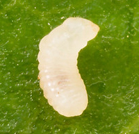
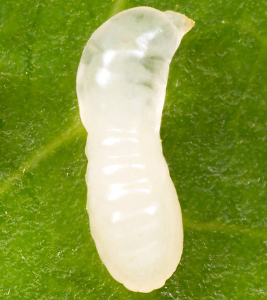
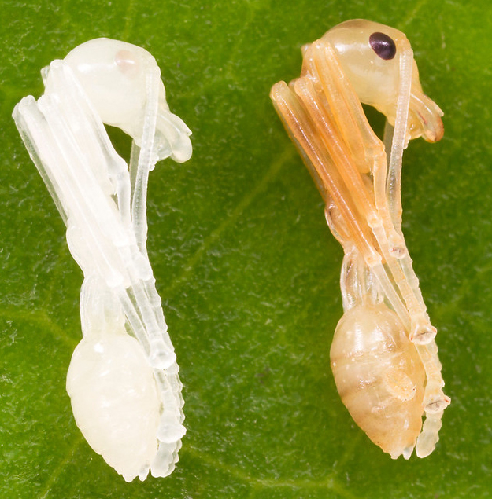
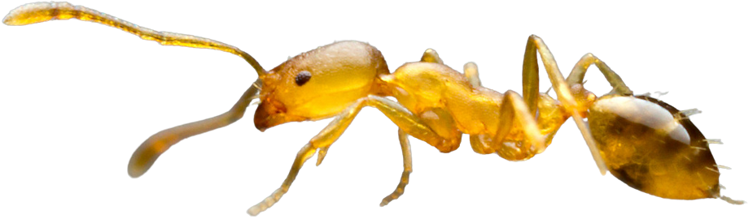
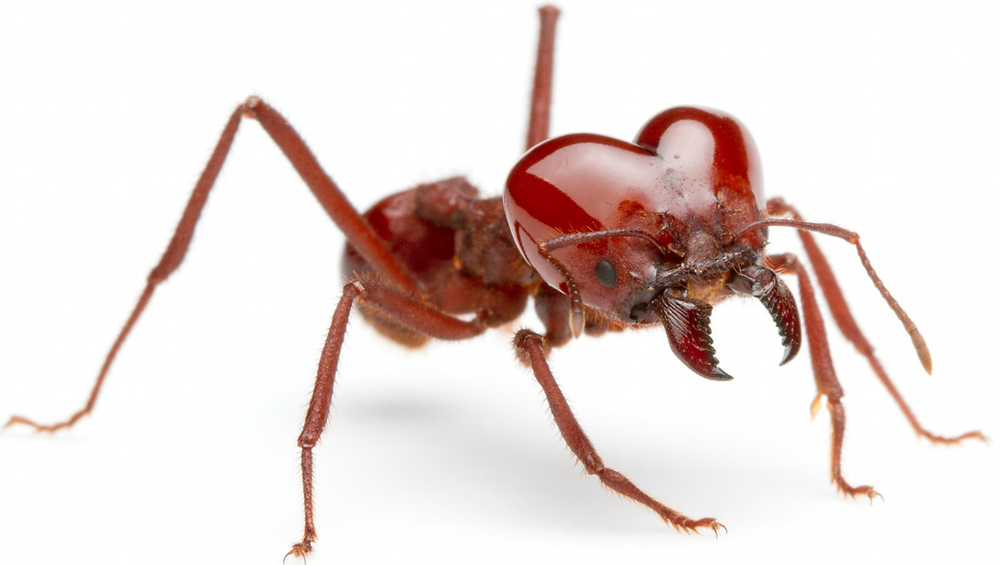
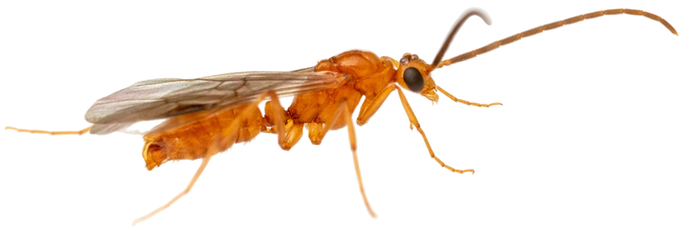
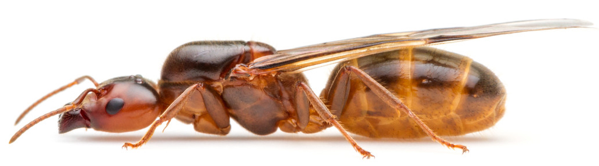

# Ants NFT Collection

## 0. Introduction

About 100 million years ago ants and wasps were one species which explains why the Founding Queens and prince consorts are big almost like wasps and have wings. However, something happened that forsed some wasp colonies to become more social than the others which meant that most citizens had to give up their individualizm for the benefit of the colony. For example, every worker ant is a female and can potentially lay eggs. But the colony prevents them from laying their own eggs but rather forces to support the **Queen** and her descendants.

The specialty of an individual ant depends on the level of care and nourishment the parents and the larva received. If the food was scarce - all the larva will grow into workers to get more food. If the food was abundant, some of the larva will turn into a "**princess ant**.""

## 1. Colony roles & appearance

Even though every ant is born from an egg, its speciality is reflected by its physical appearance similar, but more distinctive than uniforms of humans.

|Item|Name|Example Image|General Description|
|:-:|:-:|:-:|:-|
|1|Egg|[^1]|An organic vessel for protecting and incubating a foetus. The egg almost does not interacting with the external environment. Its surface is sticky which allows carying multiple eggs by a worked ant at the times of danger.|
|2|Larva||A juvenile form of Ant during its metamorphosis from an egg to an adult. Unlike the egg, larva consumes food brough by the workers to fuel growth and transfomation. The larvae have no legs but are capable of some minor movement, such as bending their head toward a food source when fed. Larva produces liquid pheromones that workers eat and dry junk that workers throw away.|
|3|Pupae||Some ant spices's larva are cocoon-spinning. They wrap themselves in thin silk threads before becoming pupae. In other species, cocoons are not used during pupae. They are out in the open and their development can easily be observed. The pupae starts out white, as the larvae, but darkens over time. All pupae are positioned in a foetal position with lowered heads and bodies shaped much like a banana.|
|4|Worker||When the pupae is fully grown and has begun to darken, it will wake up. For the first days of it’s life it will be lightly coloured and transparent in comparison to the other members of the ant colony. But after a few days it will darken and gain the same markings as it’s sisters. Most ant species let the new ants (also called nanitics) live their first time in safety, tending to the eggs, queen and other inside-duties of the colony. Then eventually they will look towards more dangerous tasks such as foraging or defending the nest. The closer one ant is to death (by age), the more economically motivated the colony is to risk it’s life.|
|5|Soldier|||
|6|Male|||
|7|Queen|||

[^1]: All the images of the ants were taken by a professional photographer [Alexander Wild](https://www.alexanderwild.com/). The photographs were borrowed for illustration of the concepts for the NFT collection designers and will never be used for commercial purposes on their own.
